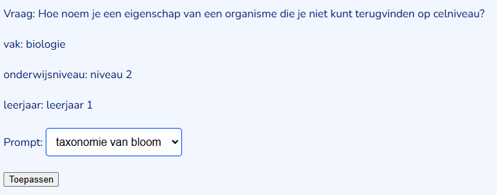

> ### Guide

---

#### Download de pakketten en open de venv file

Stap 1: Download the pakketten en open de venv files in de README.md  
Stap 2: Run de FLASK (applicatie-wp2), rechts boven in uitvouwen en dan de play knop indrukken 
Stap 3: Open de server bij Run of klik hier: http://127.0.0.1:5000  
Stap 4: Volgt hieronder  

Bij problemen van het openen kun je altijd http://127.0.0.1:5000 + /(naam van de website) proberen

---

#### Inlog scherm

Vul hier de inlognaam in + het wachtwoord:

Kies uit 1 van de onderstaande om de website te testen, tip: gebruik een admin. 
* Admin user: naam = krugw@hr.nl , wachtwoord = geheim
* Admin user: naam = test1 , wachtwoord = ww1
* Admin user: naam = julie , wachtwoord = test
* User: naam = , wachtwoord = geheimer

* Later bij 

---

#### Welkom scherm

Klik om door te gaan op de knop.

* Hier krijg je de welkom bericht met je inlog naam.

---

#### Toetsvragen scherm

* Filter hier de vragen, druk dan op zoeken en ververs als je alles weer wilt zien.
* Onder vraag, vak, datum en taxonomie kun je met de knoppen een individuele vraag selecteren en wijzigen/indexeren.

* Zoek uit de pagina nummers, dit kan ook wanneer de zoekopdracht is gefilterd.

#### Knoppen toetsvragen scherm:

* Indexeren > Naar indexeren scherm
* Indexeren van de geselecteerde vraag

* Wijzigen > Naar taxonomie wijzigen scherm
* wijzigen van de geselecteerde vraag

* AI prompts (admin only) > Naar AI prompts scherm

* Redacteuren (admin only) > Naar redacteuren scherm

---

#### Indexeren scherm

* Hier kun je de vraag indexeren en de taxonomie van bloom toepassen
* Klik op toepassen > Je krijgt nu een resultaat > Naar resultaat scherm

---

#### Taxonomie resultaat scherm

* Je hebt hier nu antwoord op je vraag gekregen met bijbehorende prompt
* Je kan nu kiezen voor onthouden, begrijpen, toepassen, analyseren, evalueren, creëren
* Klik dan op taxonomie opslaan
* Dit leid je weer terug naar de toetspagina
* Was de knop indexeren, dan is de knop nu veranderd naar wijzigen
* Was de knop wijzigen, dan is die nu overschreven met de nieuwe resultaat (als je opslaan hebt geklikt)

---

#### Taxonomie wijzigen scherm

* Hier kun je de vraag zien met de bijbehorende antwoord van bloom
* Hier kun je ook zien wat je met het antwoord wil
* Klik om door te gaan naar indexeren op wijzigen
* Klik keer terug naar home pagina, als je niks wilt veranderen

---

#### AI prompts scherm

* LET OP! Verwijder geen prompt die er al was, alleen je eigen prompts mogen verwijderd worden! 
* Hier zie je een overzicht van de prompts, ingedeelde toetsvragen en correcte antwoorden
* Klik op details van taxonomie van bloom
* Hier kun je informatie zien over de prompt en door wie die ingedeeld is
* Ga nu terug naar overzicht en klik niet op verwijderen

* Nu kun je doorgaan naar een nieuwe prompt toevoegen
* De knoppen vragen en redacteuren brengen je naar andere schermen

---

#### Ai details scherm

---

#### Nieuwe prompt scherm

---

#### Redacteuren scherm